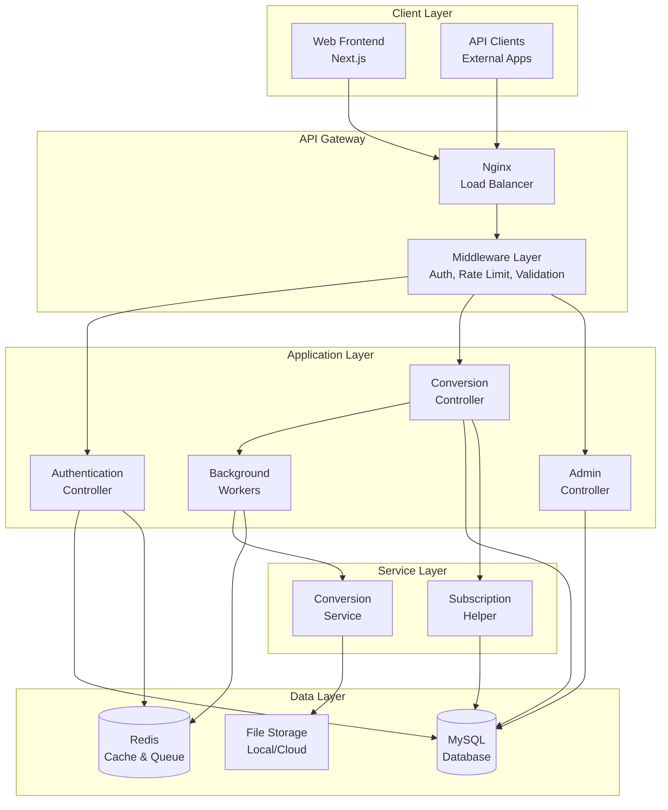
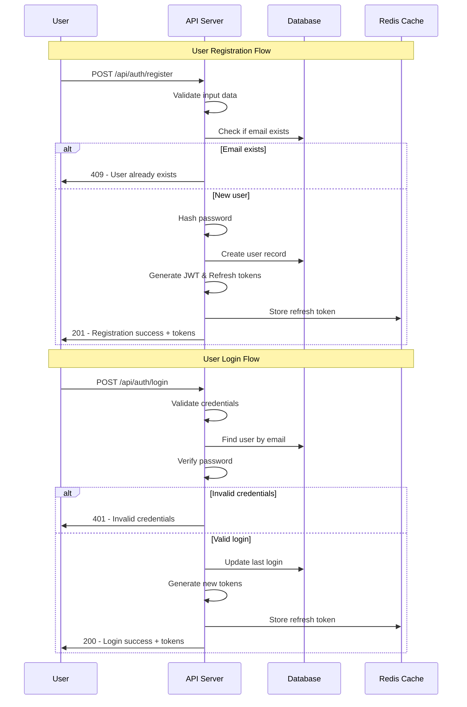
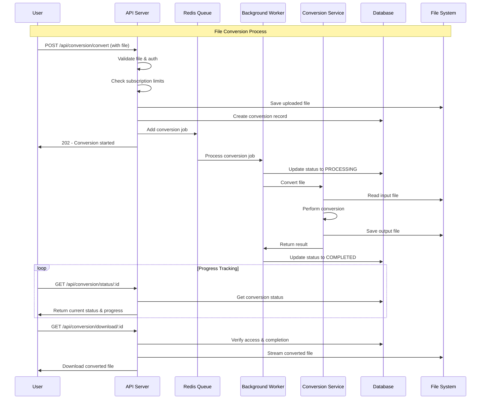
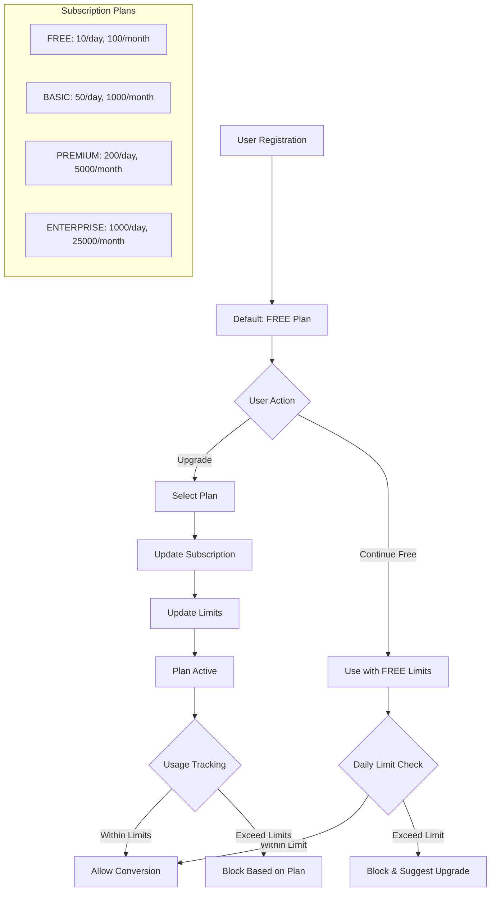
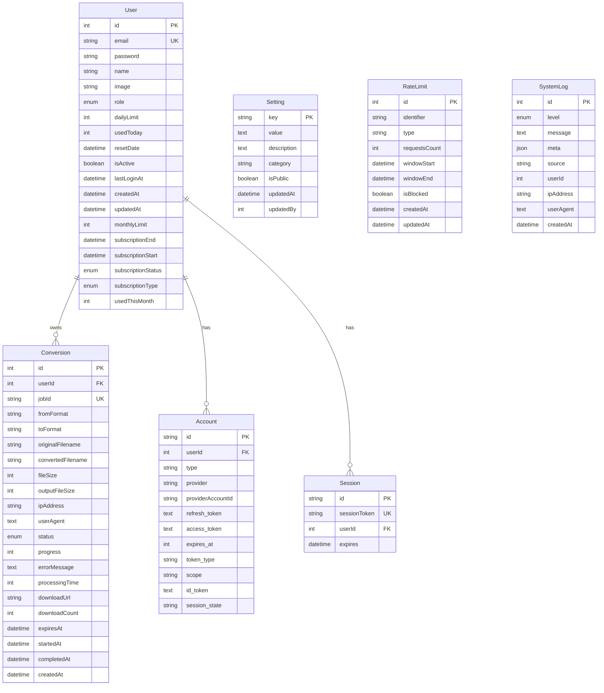

# Sơ đồ Nghiệp vụ và Dữ liệu - Convert SVG Backend

## 📋 Tổng quan Dự án

Dự án **Convert SVG** là một hệ thống web API cho phép người dùng chuyển đổi các định dạng file hình ảnh với nhau, đặc biệt tập trung vào việc chuyển đổi SVG. Hệ thống hỗ trợ nhiều định dạng file và cung cấp các tính năng quản lý người dùng, subscription, rate limiting và admin dashboard.

---

## 🏗️ Kiến trúc Hệ thống



---

## 🔄 Sơ đồ Nghiệp vụ Chính

### 1. Quy trình Đăng ký và Xác thực



### 2. Quy trình Chuyển đổi File



### 3. Quy trình Quản lý Subscription



---

## 🗄️ Sơ đồ Cơ sở Dữ liệu

### ERD (Entity Relationship Diagram)



### Các Enum Types

```sql
-- Roles
enum Role {
  USER
  PREMIUM
  ADMIN
}

-- Subscription Types
enum SubscriptionType {
  FREE
  BASIC
  PREMIUM
  ENTERPRISE
}

-- Subscription Status
enum SubscriptionStatus {
  ACTIVE
  EXPIRED
  CANCELLED
  SUSPENDED
}

-- Conversion Status
enum ConversionStatus {
  PENDING
  PROCESSING
  COMPLETED
  FAILED
  EXPIRED
  CANCELLED
}

-- Log Levels
enum LogLevel {
  ERROR
  WARN
  INFO
  DEBUG
}
```

---

## 🔧 Các Module Chính

### 1. Authentication Module

**Chức năng:**

- Đăng ký, đăng nhập, đăng xuất
- Quản lý JWT tokens và refresh tokens
- Phân quyền theo role (USER, PREMIUM, ADMIN)
- Cập nhật profile và đổi mật khẩu

**Endpoints:**

- `POST /api/auth/register` - Đăng ký
- `POST /api/auth/login` - Đăng nhập
- `POST /api/auth/refresh` - Làm mới token
- `POST /api/auth/logout` - Đăng xuất
- `GET /api/auth/profile` - Lấy thông tin profile
- `PUT /api/auth/profile` - Cập nhật profile
- `PUT /api/auth/password` - Đổi mật khẩu

### 2. Conversion Module

**Chức năng:**

- Upload và validate file
- Chuyển đổi giữa các formats: SVG, PNG, JPG, JPEG, PDF, EPS
- Theo dõi tiến trình conversion
- Download file đã convert
- Quản lý lịch sử conversion

**Endpoints:**

- `GET /api/conversion/supported` - Danh sách formats hỗ trợ
- `POST /api/conversion/convert` - Bắt đầu conversion
- `GET /api/conversion/status/:id` - Kiểm tra trạng thái
- `GET /api/conversion/download/:id` - Download file
- `GET /api/conversion/history` - Lịch sử conversion
- `DELETE /api/conversion/:id` - Xóa conversion

### 3. Admin Module

**Chức năng:**

- Quản lý users (CRUD)
- Thống kê hệ thống
- Quản lý conversions
- Cấu hình hệ thống
- Xem logs hệ thống
- Quản lý queue

**Endpoints:**

- `GET /api/admin/stats` - Thống kê tổng quan
- `GET /api/admin/users` - Danh sách users
- `PUT /api/admin/users/:id` - Cập nhật user
- `DELETE /api/admin/users/:id` - Xóa user
- `GET /api/admin/conversions` - Quản lý conversions
- `GET /api/admin/settings` - Cấu hình hệ thống
- `PUT /api/admin/settings` - Cập nhật cấu hình

### 4. Subscription Module

**Chức năng:**

- Quản lý các gói subscription
- Kiểm tra và cập nhật usage limits
- Theo dõi usage theo ngày/tháng
- Tự động reset counters

**Plans:**

- **FREE**: 10/ngày, 100/tháng
- **BASIC**: 50/ngày, 1000/tháng
- **PREMIUM**: 200/ngày, 5000/tháng
- **ENTERPRISE**: 1000/ngày, 25000/tháng

---

## 🔒 Bảo mật và Middleware

### Authentication Middleware

- Xác thực JWT tokens
- Kiểm tra token blacklist trong Redis
- Optional auth cho anonymous users

### Rate Limiting

- Giới hạn requests theo IP
- Giới hạn theo user
- Lưu trữ trong Redis với sliding window

### File Upload Security

- Validate file types và size
- Sanitize file names
- Scan for malicious content
- Temporary file cleanup

### Authorization Levels

1. **Public** - Không cần auth
2. **User** - Cần đăng nhập
3. **Premium** - Cần subscription Premium+
4. **Admin** - Chỉ admin mới truy cập được

---

## 📊 Monitoring và Logging

### System Logs

- Error tracking
- Performance monitoring
- User activity logs
- Conversion statistics

### Health Checks

- Database connectivity
- Redis connectivity
- File system status
- Queue status

### Metrics Tracked

- Total users by role
- Conversion statistics by format
- Success/failure rates
- System performance metrics
- Storage usage

---

## 🚀 Deployment và Scaling

### Production Setup

- Docker containerization
- Nginx load balancer
- PM2 process manager
- Database replication
- Redis clustering

### Backup Strategy

- Automated database backups
- File storage backup
- Configuration backup
- Log retention policies

### Scaling Considerations

- Horizontal scaling với multiple workers
- CDN cho file delivery
- Database sharding
- Redis cluster cho high availability

---

## 📈 Tối ưu Performance

### Caching Strategy

- JWT token caching
- User session caching
- Conversion status caching
- Static file caching

### Queue Management

- Background job processing
- Job prioritization
- Failed job retry logic
- Job cleanup policies

### File Management

- Temporary file cleanup
- Converted file expiration
- Storage optimization
- CDN integration

---

_Tài liệu này mô tả toàn bộ kiến trúc và quy trình nghiệp vụ của hệ thống Convert SVG Backend. Được cập nhật lần cuối: June 2025_
